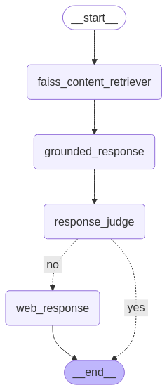

# Legal Agent Codebase

- [LinkedIn - Rajarshi Roy](https://www.linkedin.com/in/rajarshi-roy-learner/)
  
- [Github - Rajarshi Roy](https://github.com/Rajarshi12321/)

- [Medium - Rajarshi Roy](https://medium.com/@rajarshiroy.machinelearning)
  
- [Kaggle - Rajarshi Roy](https://www.kaggle.com/rajarshiroy0123/)
- [Mail - Rajarshi Roy](mailto:royrajarshi0123@gmail.com)
- [Personal-Website - Rajarshi Roy](https://rajarshi12321.github.io/rajarshi_portfolio/)


## Table of Contents

- [Legal Agent Codebase](#legal-agent-codebase)
  - [Table of Contents](#table-of-contents)
  - [About The Project](#about-the-project)
  - [Video Demo:](#video-demo)
  - [Functionality](#functionality)
  - [Code Structure](#code-structure)
  - [Dependencies](#dependencies)
  - [Working with the code](#working-with-the-code)
  - [Deploying the project from your side (In AWS)](#deploying-the-project-from-your-side-in-aws)
  - [Contributing](#contributing)
  - [Contact](#contact)
  - [License](#license)


## About The Project

This projects aim to implements a sophisticated document retrieval and question answering system using LangChain, leveraging Google's Gemini-1.5-flash language model and a FAISS vector database.  The system is designed to handle legal queries, providing comprehensive and accurate answers by combining information retrieval from a local knowledge base with web search capabilities when necessary.

## Video Demo:

https://github.com/user-attachments/assets/5a6b3076-404a-4815-a722-2f6563929003


## Functionality

The system follows a multi-stage workflow:

1. **Query Input:** The user provides a query (e.g., a legal question).

2. **FAISS Retrieval:** The query is embedded using Google Generative AI embeddings, and the FAISS index (a local vector database) is queried to retrieve the most relevant documents.

3. **Grounded Response Generation:** A `DocSummarizerPipeline` summarizes the retrieved documents, focusing on the user's query.  This summary attempts to directly answer the question using only the retrieved documents.

4. **Response Evaluation:** An `IntermediateStateResponseEvaluator` assesses the quality and completeness of the generated response.  This evaluation uses the Gemini model to determine if the response sufficiently answers the query.

5. **Web Search (Conditional):** If the generated response is deemed insufficient, a `WebSearchAgent` performs a web search using DuckDuckGo to gather additional information.  The results are then incorporated into the final response.

6. **Response Output:** The final answer, either from the document summary or the combined document/web search result, is returned to the user.
  

## Code Structure

The code is organized into several classes and functions:

* **`DocumentRetriever`:** Loads and interacts with the FAISS index, retrieving relevant documents based on a query.
* **`FaissRetriever`:** Loads and interacts with the FAISS index, retrieving relevant documents based on a query.

* **`DocSummarizerPipeline`:** Summarizes retrieved documents using the Gemini model, generating a concise answer focused on the user's query.  It uses a carefully crafted prompt to ensure the response is structured and informative.

* **`WebSearchAgent`:** Performs web searches using DuckDuckGo and integrates the results into the response.

* **`IntermediateStateResponseEvaluator`:** Evaluates the quality of the generated response using the Gemini model, determining if additional information is needed.

* **`State` (TypedDict):** Defines the data structure for passing information between stages of the workflow.

* **Workflow Functions (`faiss_content_retriever`, `grounded_response`, `response_judge`, `web_response`):** These functions represent individual nodes in the LangGraph workflow.

* **`StateGraph`:** Defines the workflow using LangGraph, managing the flow of data between the different stages.  Conditional logic is implemented to determine whether a web search is necessary.

* **`run_user_query`:** The main function that takes a user query and processes it through the LangGraph workflow.
<div align="center">
Agent Workflow:


</div>

## Dependencies

The code relies on several libraries:

* `langgraph`
* `langchain-core`
* `langchain-google-genai`
* `IPython`
* `dotenv`
* `google.generativeai`
* `langchain.chains.question_answering`
* `langchain.prompts`
* `langchain.vectorstores`
* `langchain_community.tools`
* `langchain.agents`


## Working with the code


I have commented most of the neccesary information in the respective files.

To run this project locally, please follow these steps:-

1. Clone the repository:

   ```shell
   git clone https://github.com/Rajarshi12321/legal-agent.git
   ```


2. **Create a Virtual Environment** (Optional but recommended)
  It's a good practice to create a virtual environment to manage project dependencies. Run the following command:
     ```shell
     conda create -p <Environment_Name> python==<python version> -y
     ```
     Example:
     ```shell
     conda create -p venv python=3.9 -y 
     ```
    Note:
    - It is important to use python=3.9 or above for proper use of Langchain or else you would get unexpecterd errors


3. **Activate the Virtual Environment** (Optional)
   Activate the virtual environment based on your operating system:
      ```shell
      conda activate <Environment_Name>/
      ```
      Example:
     ```shell
     conda activate venv/
     ```

4. **Install Dependencies**
  
   - Run the following command to install project dependencies:
     ```
     pip install -r requirements.txt
     ```

   Ensure you have Python installed on your system (Python 3.9 or higher is recommended).<br />
   Once the dependencies are installed, you're ready to use the project.

5. Create a .env file in the root directory and add your Gemini and Langchain credentials as follows:
    ```shell  
    GOOGLE_API_KEY = "xxxxxxxxxxxxxxxxxxxxxxxxxxxxx"
    ```


6. Run the Flask app: Execute the following code in your terminal.
   ```shell  
   chainlit run app.py 
   ```
   

6. Access the app: Open your web browser and navigate to http://localhost:8000/ to use the House Price Prediction and Property Recommendation app.

## Deploying the project from your side (In AWS)

I have already made a github actions file in `.github\workflows\main.yaml`
To use it you need to the following prerequisites:

1. Make a IAM Role from your aws account
- 1. Login to AWS console.

- 2. Create IAM user for deployment

	#with specific access

	1. EC2 access : It is virtual machine

	2. ECR: Elastic Container registry to save your docker image in aws


	#Policy: (You need to select these policies when building the user)

	1. AmazonEC2ContainerRegistryFullAccess

	2. AmazonEC2FullAccess

2. Building the full infrastructure using Terraform </br></br>
  1st you need to configure your aws account using the created IAM role by the command `aws configure` so that terraform can know which account to use </br></br>
  NOTE: If you don't want to use terraform for building infrastructure you can also build this manually from aws console:</br>
  For reference watch this video from `3:47:20` time frame : [Youtube link](https://www.youtube.com/watch?v=86BKEv0X2xU)</br></br>
  Get to the terraform directory: `infrastructure\terraform` and execute the following commands:
  </br></br>
  Initializing Terraform
    ```shell  
    terraform init 
    ```
    Forming a plan according the described infrastructure
    ```shell  
    terraform plan 
    ```
    Applying the planned infrastructure to build necessary resources
    ```shell  
    terraform apply -auto-approve
    ```

    </br></br>
3. After this you Need to configure your EC2 instance to install Docker:
</br>Run The Following commands:
    ```shell  
    sudo apt-get update -y

    sudo apt-get upgrade
      

    curl -fsSL https://get.docker.com -o get-docker.sh

    sudo sh get-docker.sh

    sudo usermod -aG docker ubuntu

    newgrp docker
   ```
4. After this you need to configure the self-runner for github actions to actually deploy it to EC2 instance:
  </br></br>
  Check out the [Youtube vidoe](https://www.youtube.com/watch?v=86BKEv0X2xU) for reference from 3:54:38 time frame
  </br></br>
  The commands for settinng up self-hosted runner will be like: </br></br>
  (NOTE: Do use the commands from your actions runner, the below commands are just for your reference)

    ```shell  
    mkdir actions-runner && cd actions-runner

    curl -o actions-runner-linux-x64-2.316.1.tar.gz -L https://github.com/actions/runner/releases/download/v2.316.1/actions-runner-linux-x64-2.316.1.tar.gz


    echo "d62de2400eeeacd195db91e2ff011bfb646cd5d85545e81d8f78c436183e09a8  actions-runner-linux-x64-2.316.1.tar.gz" | shasum -a 256 -c


    tar xzf ./actions-runner-linux-x64-2.316.1.tar.gz

    ./config.sh --url https://github.com/Rajarshi12321/main_app_deploy --token AWSY7XQOYHXWPQKGRAEQWRDGJD2GS

    ./run.sh

    ```

   name the runner as : `self-hosted`

1. Follow the Following [youtube video](https://www.youtube.com/watch?v=86BKEv0X2xU) from `3:57:14` time frame to know which secret Key and Value to add to your github actions secrets. Additionlly you have to add the `GOOGLE_API_KEY` in the secrets to with same key name as used in `.env` and their api keys as the values.

2. Finally after doing all this you can run you github actions smoothly which is run by the instructions of `.github\workflows\main.yaml`
   </br></br>
  **Description: About the deployment by main.yaml**

	1. Build docker image of the source code

	2. Push your docker image to ECR

	3. Launch Your EC2 

	4. Pull Your image from ECR in EC2

	5. Lauch your docker image in EC2


  Now making any changes in any file except the readme.md file and assets folder (which contains images for readme)  will trigger the github action CI/CD pipeline for development.

  NOTE: Do keep an eye on the state of the `self-hosted` runner, if its `idle` or `offline` then fix the condition my connecting to ec2 instance and run the `run.sh` file by:

  ```shell
  cd actions-runner

  ./run.sh
  ```


## Contributing
I welcome contributions to improve the functionality and performance of the app. If you'd like to contribute, please follow these guidelines:

1. Fork the repository and create a new branch for your feature or bug fix.

2. Make your changes and ensure that the code is well-documented.

3. Test your changes thoroughly to maintain app reliability.

4. Create a pull request, detailing the purpose and changes made in your contribution.

## Contact

Rajarshi Roy - [royrajarshi0123@gmail.com](mailto:royrajarshi0123@gmail.com)


## License
This project is licensed under the MIT License. Feel free to modify and distribute it as per the terms of the license.

I hope this README provides you with the necessary information to get started with the road to Generative AI with Google Gemini and Langchain.

